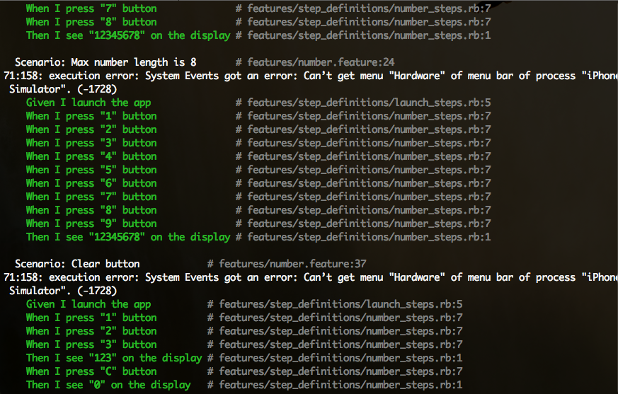

!SLIDE full-page-image

!SLIDE
.huge Frank

!SLIDE
# Work by  stick many  pieces together #

!SLIDE
# How It Works #

!SLIDE
## 1. iOS Accessibility ##

!SLIDE
## 2. UISpec ##
### Query and validate ###

    @@@ c
    -(void)itShouldNotAddAnInvalidUser {
      [app.tableViewCell touch];
      [app.label.should.have text@"User Profile"];
    }

!SLIDE full-page-image
## 3. Embedded web server ##

!SLIDE full-page-image
## 4. Driver (frank-cucumber) ##

!SLIDE small
## 5. Executable test in cucumber ##

    @@@ ruby
    Feature: 
      As a student
      I want to input numbers to 
      calculator
      So I can calculate

      Scenario: Input Number
        Given I launch the app
        When I press "1" button
        When I press "2" button
        When I press "3" button
        Then I see "123" on display
        
!SLIDE incremental
## Frank Features
- Use Ruby and Cucumber
- Record Video
- Integrates with CI
- Great Community

