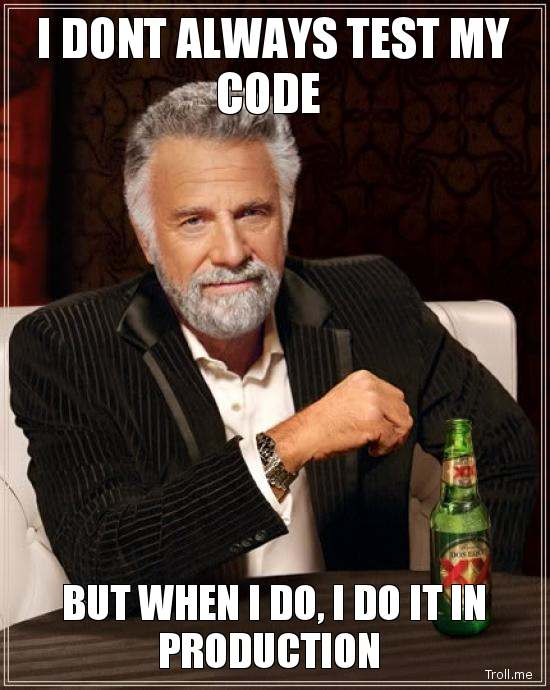

!SLIDE 
# iOS Automated  Acceptance Test with Cucumber and Frank

### Francis Chong @ Ignition Soft

!SLIDE
# Agenda #

* Test
* Frank
* Cucumber
* Demo

!SLIDE
.huge Test

!SLIDE
# Software

!SLIDE
## Have You Developed?

!SLIDE
## Have You Delivered?

!SLIDE
## Have You Tested?

!SLIDE

!SLIDE full-page-image clear-header

## SDLC

!SLIDE
## So what is software testing?

!SLIDE quote

<blockquote>"<b>Software testing</b> is an investigation conducted to provide stakeholders with information about the quality of the product."</blockquote>

!SLIDE
## Many Kind of Tests

!SLIDE
## Functional Test
  - Unit test
  - Integration test
  - System Integration test
  - Acceptance test

!SLIDE
## Non-Functional Test
  - Performan test
  - Usability test
  - Security test