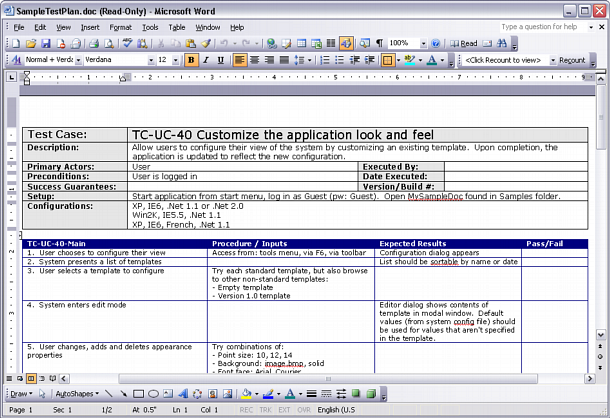
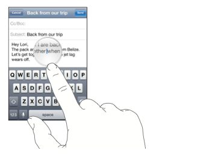
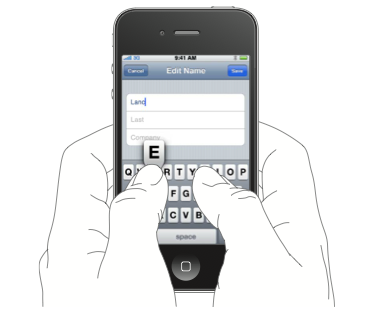

!SLIDE
# Acceptance Test

!SLIDE
## a typical iOS acceptance test

!SLIDE full-page-image

# Install Your App

!SLIDE full-page-image

# Test Plan

!SLIDE
## Tap

!SLIDE
## Tap Tap

!SLIDE
## Tap Tap Tap

!SLIDE full-page-image

!SLIDE 
## Repeat this 10~100 times

!SLIDE
## For each release

!SLIDE

## Can this be simpler?

!SLIDE
.bigger Automation

!SLIDE incremental
## iOS Automated Test Tools

- UIAutomation (javascript)
- UISpec (obj-c)
- KIF (obj-c)
- Frank (ruby)
